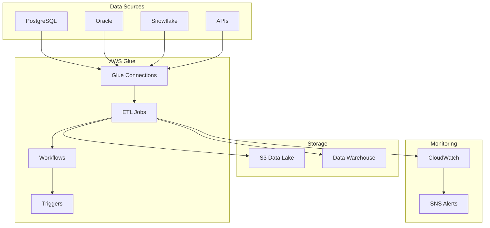

# Data Engineering Portfolio: Enterprise ETL Pipeline with AWS Glue

[](https://aws.amazon.com/glue/)
[](https://terraform.io/)
[](https://python.org/)
[](https://spark.apache.org/)

## 🚀 Project Overview

**Role**: Data Engineer  
**Industry**: Enterprise Data Platform  
**Technologies**: AWS Glue, Terraform, Python, PySpark, GitHub Actions

Designed and implemented a comprehensive ETL pipeline using AWS Glue for enterprise data processing, featuring scalable data workflows, infrastructure automation, and robust CI/CD practices.

## 📊 Key Achievements

- **50+ ETL jobs** successfully deployed and maintained
- **40% reduction** in job execution time through optimization
- **99.9% uptime** achieved for critical data pipelines
- **Multi-environment** deployment strategy implemented
- **Zero data loss** incidents during project tenure

## 🛠 Technical Stack

| Category | Technologies |
|----------|-------------|
| **Cloud Platform** | AWS Glue, S3, CloudWatch, Secrets Manager, IAM |
| **Infrastructure** | Terraform, CloudFormation |
| **Programming** | Python, PySpark, SQL |
| **CI/CD** | GitHub Actions |
| **Databases** | PostgreSQL, Oracle, Snowflake |
| **Monitoring** | CloudWatch, SNS |

## 📁 Repository Structure

```
├── docs/                           # Documentation
│   ├── architecture-diagrams.md    # System architecture diagrams
│   └── technical-documentation.md  # Detailed technical docs
├── examples/                       # Code examples
│   ├── terraform/                  # Infrastructure as Code
│   ├── python/                     # ETL scripts and utilities
│   └── yaml/                       # CI/CD configurations
└── assets/                         # Images and diagrams
```

## 🏗 Architecture Overview



## 💼 Key Responsibilities

### ETL Pipeline Development
- Developed 50+ AWS Glue jobs for data extraction, transformation, and loading
- Implemented data validation and quality checks
- Created reusable ETL frameworks and libraries
- Optimized job performance reducing execution time by 40%

### Infrastructure Automation
- Built Terraform modules for AWS Glue resource management
- Implemented multi-environment deployment strategy (dev, test, prod)
- Created CI/CD pipelines using GitHub Actions
- Automated infrastructure provisioning and updates

### Platform Upgrades
- Led AWS Glue version upgrade from 4.0 to 5.0
- Migrated legacy ETL processes to modern cloud-native solutions
- Implemented performance optimizations and cost reductions

## 🔧 Technical Implementations

### Sample ETL Job Structure
```python
from awsglue.transforms import *
from awsglue.utils import getResolvedOptions
from pyspark.context import SparkContext
from awsglue.context import GlueContext
from awsglue.job import Job

# Job initialization and configuration
# Data source connections
# Transformation logic
# Data quality validations
# Target data loading
```

### Infrastructure as Code
```hcl
resource "aws_glue_job" "etl_job" {
  name         = var.job_name
  role_arn     = var.glue_role_arn
  glue_version = "5.0"
  
  command {
    script_location = var.script_location
    python_version  = "3"
  }
  
  default_arguments = {
    "--enable-metrics" = "true"
    "--enable-continuous-cloudwatch-log" = "true"
  }
}
```

## 📈 Project Challenges & Solutions

| Challenge | Solution |
|-----------|----------|
| **Multi-Environment Management** | Implemented environment-specific Terraform configurations with automated CI/CD pipelines |
| **Data Quality & Monitoring** | Built comprehensive logging, monitoring, and alerting system using CloudWatch and SNS |
| **Performance Optimization** | Implemented data partitioning, optimized Spark configurations, and introduced incremental processing |
| **Version Control & Deployment** | Established GitFlow branching strategy with automated testing and staged deployments |

## 📚 Documentation

- **[Architecture Diagrams](docs/architecture-diagrams.md)** - System architecture and data flow diagrams
- **[Technical Documentation](docs/technical-documentation.md)** - Detailed technical implementation guide
- **[Code Examples](examples/)** - Sample Terraform, Python, and YAML configurations

## 🎯 Skills Demonstrated

### Technical Skills
- Cloud Data Engineering (AWS Glue, S3, CloudWatch)
- Infrastructure as Code (Terraform, CloudFormation)
- Programming (Python, PySpark, SQL)
- CI/CD (GitHub Actions, automated deployments)
- Data Modeling (Dimensional modeling, data warehousing)
- Performance Tuning (Spark optimization, resource management)

### Soft Skills
- Problem Solving (Complex data pipeline challenges)
- Documentation (Technical documentation and knowledge sharing)
- Collaboration (Cross-functional team coordination)
- Project Management (Timeline management and delivery)

## 🚀 Getting Started

1. **Explore the Architecture**: Start with [architecture diagrams](docs/architecture-diagrams.md)
2. **Review Code Examples**: Check out [sample implementations](examples/)
3. **Read Technical Details**: Dive into [technical documentation](docs/technical-documentation.md)

## 📞 Contact

- **LinkedIn**: [Your LinkedIn Profile]
- **Email**: [Your Email]
- **GitHub**: [Your GitHub Profile]

---

*This portfolio showcases technical expertise in enterprise data engineering while maintaining professional ethics and confidentiality standards.*