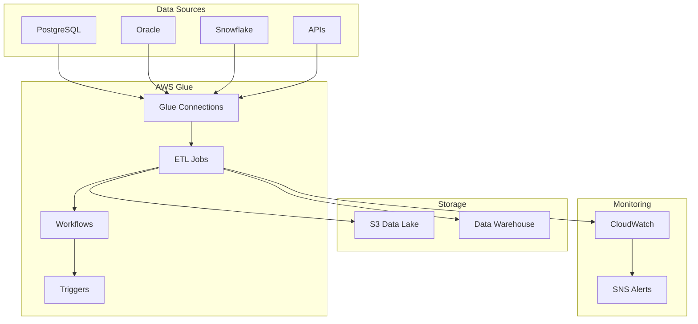
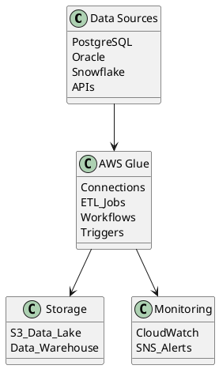

# ETL Pipeline Architecture Diagrams

## 1. High-Level System Architecture

```
┌─────────────────────────────────────────────────────────────────────────────────┐
│                           Enterprise ETL Pipeline Architecture                   │
└─────────────────────────────────────────────────────────────────────────────────┘

┌──────────────┐    ┌──────────────┐    ┌──────────────┐    ┌──────────────┐
│   Data       │    │   Extract    │    │  Transform   │    │    Load      │
│   Sources    │───▶│   Layer      │───▶│   Layer      │───▶│   Layer      │
└──────────────┘    └──────────────┘    └──────────────┘    └──────────────┘
       │                     │                   │                   │
       ▼                     ▼                   ▼                   ▼
┌─────────────┐    ┌─────────────┐    ┌─────────────┐    ┌─────────────┐
│ PostgreSQL  │    │ AWS Glue    │    │ PySpark     │    │ Data Lake   │
│ Oracle      │    │ Connections │    │ Jobs        │    │ (S3)        │
│ Snowflake   │    │             │    │             │    │ Data Warehouse│
│ APIs        │    │             │    │             │    │             │
└─────────────┘    └─────────────┘    └─────────────┘    └─────────────┘

┌─────────────────────────────────────────────────────────────────────────────────┐
│                              Orchestration Layer                                │
│  ┌─────────────┐  ┌─────────────┐  ┌─────────────┐  ┌─────────────┐           │
│  │ Workflows   │  │ Triggers    │  │ Scheduling  │  │ Monitoring  │           │
│  │             │  │             │  │             │  │             │           │
│  └─────────────┘  └─────────────┘  └─────────────┘  └─────────────┘           │
└─────────────────────────────────────────────────────────────────────────────────┘

┌─────────────────────────────────────────────────────────────────────────────────┐
│                           Infrastructure & DevOps                               │
│  ┌─────────────┐  ┌─────────────┐  ┌─────────────┐  ┌─────────────┐           │
│  │ Terraform   │  │ GitHub      │  │ CloudWatch  │  │ Secrets     │           │
│  │ IaC         │  │ Actions     │  │ Monitoring  │  │ Manager     │           │
│  └─────────────┘  └─────────────┘  └─────────────┘  └─────────────┘           │
└─────────────────────────────────────────────────────────────────────────────────┘
```

## 2. AWS Glue ETL Pipeline Flow

```
┌─────────────────────────────────────────────────────────────────────────────────┐
│                            AWS Glue ETL Pipeline                                │
└─────────────────────────────────────────────────────────────────────────────────┘

Data Sources                 AWS Glue                    Target Systems
┌─────────────┐             ┌─────────────┐             ┌─────────────┐
│ PostgreSQL  │────────────▶│             │             │             │
│ Database    │             │   Glue      │             │   Amazon    │
└─────────────┘             │ Connection  │             │     S3      │
                            │             │             │ Data Lake   │
┌─────────────┐             └─────────────┘             │             │
│   Oracle    │────────────▶       │                    └─────────────┘
│  Database   │                    │                           ▲
└─────────────┘                    ▼                           │
                            ┌─────────────┐                    │
┌─────────────┐             │             │                    │
│ Snowflake   │────────────▶│ Glue ETL    │────────────────────┘
│   Cloud     │             │    Jobs     │
│ Warehouse   │             │             │
└─────────────┘             │ • Extract   │             ┌─────────────┐
                            │ • Transform │             │ Data        │
┌─────────────┐             │ • Validate  │────────────▶│ Warehouse   │
│ REST APIs   │────────────▶│ • Load      │             │ (Snowflake) │
│ External    │             │             │             │             │
│ Systems     │             └─────────────┘             └─────────────┘
└─────────────┘                    │
                                   ▼
                            ┌─────────────┐
                            │ CloudWatch  │
                            │ Logs &      │
                            │ Metrics     │
                            └─────────────┘
```

## 3. CI/CD Pipeline Architecture

```
┌─────────────────────────────────────────────────────────────────────────────────┐
│                              CI/CD Pipeline                                     │
└─────────────────────────────────────────────────────────────────────────────────┘

Developer Workflow                GitHub Actions                 AWS Deployment
┌─────────────┐                  ┌─────────────┐                ┌─────────────┐
│             │                  │             │                │             │
│ Developer   │                  │   GitHub    │                │    AWS      │
│   Code      │─────────────────▶│  Actions    │───────────────▶│ Resources   │
│ Changes     │                  │  Workflow   │                │             │
│             │                  │             │                │             │
└─────────────┘                  └─────────────┘                └─────────────┘
       │                                │                              │
       ▼                                ▼                              ▼
┌─────────────┐                  ┌─────────────┐                ┌─────────────┐
│ Feature     │                  │ Terraform   │                │ Glue Jobs   │
│ Branch      │                  │ Plan &      │                │ Workflows   │
│ Creation    │                  │ Apply       │                │ Triggers    │
└─────────────┘                  └─────────────┘                └─────────────┘
       │                                │                              │
       ▼                                ▼                              ▼
┌─────────────┐                  ┌─────────────┐                ┌─────────────┐
│ Pull        │                  │ Environment │                │ Multi-Env   │
│ Request     │                  │ Specific    │                │ Deployment  │
│ Review      │                  │ Deployment  │                │ (Dev/Prod)  │
└─────────────┘                  └─────────────┘                └─────────────┘

Environment Flow:
Feature Branch → Sandbox → Development → Test → Stage → Production
     ↓             ↓           ↓          ↓       ↓         ↓
   Manual      Auto Deploy  Auto Deploy Manual Manual  Manual Review
   Testing      on Merge    on Merge   Testing Testing  & Approval
```

## 4. Data Flow Architecture

```
┌─────────────────────────────────────────────────────────────────────────────────┐
│                              Data Flow Diagram                                  │
└─────────────────────────────────────────────────────────────────────────────────┘

Source Systems          Ingestion Layer         Processing Layer        Target Layer
┌─────────────┐         ┌─────────────┐         ┌─────────────┐         ┌─────────────┐
│             │         │             │         │             │         │             │
│ Operational │────────▶│   AWS S3    │────────▶│ AWS Glue    │────────▶│ Data Lake   │
│ Databases   │         │ Raw Data    │         │ ETL Jobs    │         │ Curated     │
│             │         │ Landing     │         │             │         │ Data        │
└─────────────┘         └─────────────┘         └─────────────┘         └─────────────┘
       │                       │                       │                       │
       │                       │                       │                       │
┌─────────────┐         ┌─────────────┐         ┌─────────────┐         ┌─────────────┐
│ External    │────────▶│ Staging     │────────▶│ Data        │────────▶│ Analytics   │
│ APIs        │         │ Area        │         │ Validation  │         │ Layer       │
│             │         │             │         │ & Quality   │         │             │
└─────────────┘         └─────────────┘         └─────────────┘         └─────────────┘
       │                       │                       │                       │
       │                       │                       │                       │
┌─────────────┐         ┌─────────────┐         ┌─────────────┐         ┌─────────────┐
│ File        │────────▶│ Error       │────────▶│ Business    │────────▶│ Reporting   │
│ Systems     │         │ Handling    │         │ Logic       │         │ & BI Tools  │
│             │         │ & Logging   │         │ Transform   │         │             │
└─────────────┘         └─────────────┘         └─────────────┘         └─────────────┘

Data Quality & Monitoring
┌─────────────────────────────────────────────────────────────────────────────────┐
│  ┌─────────────┐  ┌─────────────┐  ┌─────────────┐  ┌─────────────┐           │
│  │ Data        │  │ CloudWatch  │  │ SNS         │  │ Email       │           │
│  │ Validation  │  │ Metrics     │  │ Alerts      │  │ Notifications│          │
│  └─────────────┘  └─────────────┘  └─────────────┘  └─────────────┘           │
└─────────────────────────────────────────────────────────────────────────────────┘
```

## 5. Infrastructure as Code Architecture

```
┌─────────────────────────────────────────────────────────────────────────────────┐
│                        Infrastructure as Code (IaC)                             │
└─────────────────────────────────────────────────────────────────────────────────┘

Version Control          Terraform Modules           AWS Resources
┌─────────────┐         ┌─────────────┐             ┌─────────────┐
│             │         │             │             │             │
│   GitHub    │────────▶│   Glue      │────────────▶│ AWS Glue    │
│ Repository  │         │   Module    │             │ Jobs        │
│             │         │             │             │             │
└─────────────┘         └─────────────┘             └─────────────┘
       │                       │                           │
       │                       │                           │
┌─────────────┐         ┌─────────────┐             ┌─────────────┐
│ Terraform   │────────▶│    S3       │────────────▶│ S3 Buckets  │
│ Config      │         │  Module     │             │ & Policies  │
│ Files       │         │             │             │             │
└─────────────┘         └─────────────┘             └─────────────┘
       │                       │                           │
       │                       │                           │
┌─────────────┐         ┌─────────────┐             ┌─────────────┐
│ Environment │────────▶│ Connection  │────────────▶│ Glue        │
│ Variables   │         │  Module     │             │ Connections │
│ (.tfvars)   │         │             │             │             │
└─────────────┘         └─────────────┘             └─────────────┘

State Management                      Resource Dependencies
┌─────────────┐                      ┌─────────────────────────────────┐
│ Terraform   │                      │ S3 Bucket → Glue Jobs →        │
│ Remote      │                      │ Workflows → Triggers →          │
│ State       │                      │ CloudFormation Stacks          │
│ (S3)        │                      └─────────────────────────────────┘
└─────────────┘
```

## 6. Monitoring & Alerting Architecture

```
┌─────────────────────────────────────────────────────────────────────────────────┐
│                        Monitoring & Alerting System                             │
└─────────────────────────────────────────────────────────────────────────────────┘

ETL Jobs                    Monitoring Layer              Alerting Layer
┌─────────────┐            ┌─────────────┐               ┌─────────────┐
│             │            │             │               │             │
│ Glue Job    │───────────▶│ CloudWatch  │──────────────▶│    SNS      │
│ Execution   │            │   Logs      │               │   Topics    │
│             │            │             │               │             │
└─────────────┘            └─────────────┘               └─────────────┘
       │                          │                             │
       │                          │                             │
┌─────────────┐            ┌─────────────┐               ┌─────────────┐
│ Job         │───────────▶│ CloudWatch  │──────────────▶│   Email     │
│ Metrics     │            │  Metrics    │               │ Notifications│
│             │            │             │               │             │
└─────────────┘            └─────────────┘               └─────────────┘
       │                          │                             │
       │                          │                             │
┌─────────────┐            ┌─────────────┐               ┌─────────────┐
│ System      │───────────▶│ CloudWatch  │──────────────▶│ Dashboard   │
│ Health      │            │ Dashboards  │               │ & Reports   │
│             │            │             │               │             │
└─────────────┘            └─────────────┘               └─────────────┘

Alert Types:
• Job Failure Alerts
• Performance Degradation
• Data Quality Issues
• Resource Utilization
• Cost Optimization Alerts
```

## Mermaid Diagram Code (for GitHub/Documentation)



## PlantUML Code (Alternative)



## Usage Instructions

### For GitHub README:
1. Copy the ASCII diagrams directly into your README.md
2. Use the Mermaid code blocks for interactive diagrams
3. GitHub automatically renders Mermaid diagrams

### For Documentation:
1. Use ASCII art for simple text-based documentation
2. Convert PlantUML to images using online tools
3. Use draw.io or Lucidchart for professional diagrams

### For Presentations:
1. Convert ASCII to images using online ASCII-to-image tools
2. Use the architecture descriptions to create slides
3. Customize colors and styling as needed

These diagrams showcase your understanding of:
- **System Architecture Design**
- **Data Flow Patterns**
- **Infrastructure as Code**
- **CI/CD Pipeline Design**
- **Monitoring & Observability**
- **AWS Cloud Services Integration**
